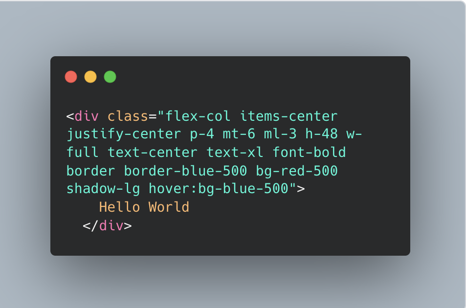
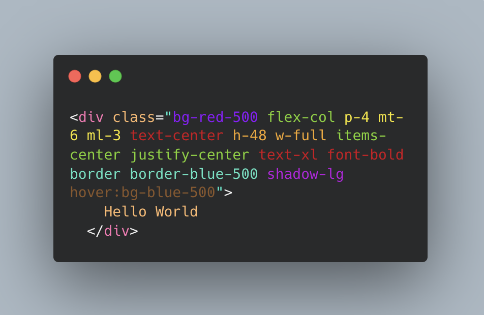
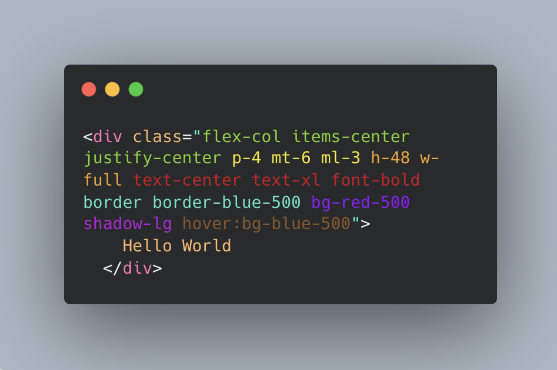

# FormatwindCSS
## About
FormatwindCSS is a tailwindCSS tool that organizes utility classes based on their sphere of influence within the Element.
1. Flexbox and Grid
2. Spacing
3. Sizing
4. Typography
5. Borders
6. Backgrounds
7. Effects
8. Transition and Animations

### Before


### Labeled


### After


This creates a more user friendly schema for finding classes within elements when the number of utility classes grows large.

#### Input
```
<button class="inline-flex items-center justify-
center px-6 py-3 text-base font-medium text-white bg-
blue-600 border border-transparent rounded-md shadow-
sm hover:bg-blue-700 focus:outline-none focus:ring-2
focus:ring-offset-2 focus:ring-blue-500 sm:w-auto 
sm:text-sm md:text-lg lg:text-xl xl:text-2xl 
transition duration-150 ease-in-out transform 
hover:scale-105 active:scale-95 disabled:opacity-50 
disabled:cursor-not-allowed">
Click me!
</button>

```
#### Output
```
<button class="inline-flex px-6 py-3 items-center
shadow-sm sm:w-auto font-medium text-base md:text-lg 
sm:text-sm text-white lg:text-xl hover:bg-blue-700
border border-transparent rounded-md 
disabled:opacity-50 disabled:cursor-not-allowed
duration-150 ease-in-out focus:outline-none
focus:ring-2 focus:ring-offset-2 focus:ring-blue-500 
hover:scale-105 active:scale-95 xl:text-2xl
transform transition justify-center bg-blue-600">
Click me!
</button>
```

## Installation

with git installed run: 
```
git clone git@github.com:Hunter-Lanier/FormatwindCSS.git
cd FromatwindCSS
npm run install
npm run dev

---<Result>---
➜  Local:   http://localhost:<PORT>/
```

## How it's done
By using the safelist feature within the tailwind.config file, we are able to generate a list of all possible CSS Classes.
``` // Tailwind Config  
module.exports = {  
safelist: [  
{  
pattern: /./,  
variants: ['md', 'lg', 'xl',...],
},  
],  
theme: {}  
}
```
After that, we can use this code to rebuild css output:
```
npx tailwindcss -i ./src/input.css -o ./src/output.css --watch
```
Here is a chunk of the output.css: 
```.pointer-events-none {
pointer-events: none;
}
.pointer-events-auto {
pointer-events: auto;
}
.visible {
visibility: visible;
}
.invisible {
visibility: hidden;
}
.collapse {
visibility: collapse;
} 
.static {
position: static;
}
.fixed {
position: fixed;
}
```
Then we use a Python Script to extract the class names from this file, and then trim by removing weights of colors and numeric values of the classes. This shrinks the list from ~10k classes to ~1,000 classes.
```
import re

  

def  extract_css_classes(css_file_path):

with  open(css_file_path, 'r') as  file:

css_content =  file.read()

  

class_pattern =  r'\.[-_a-zA-Z0-9]+(?=[^}]*\{)'

matches = re.findall(class_pattern, css_content)

class_names =  list(set(match[1:] for match in matches))

return  sorted(class_names)

  

css_file_path =  'output.css'

try:

class_names = extract_css_classes(css_file_path)

except  Exception  as e:

print(f"An error occurred: {str(e)}")

  

class_names = [re.sub(r'(-\d+)', '', class_name) for class_name in class_names]

class_names =  list(set(class_names))

  

with  open('output.txt', 'w') as f:

for item in class_names:

f.write("%s\n"  % item)
```
With a smaller number of classes now, we can feed the list of of classes to a LLM and have it organize the classes based on the 8 Categories we listed before. The results is an organized list of our classes that we can now feed to Vue as a data point.
```
data() {

return  {
classOrderPatterns: ['absolute', 'block', 'box-border',...],
}
```
and finally, we create a method for organizing the classes based on the structure within our Array.

## Roadmap / Contributing
* Create VSCode Exstension
	* Format on Save (via Prettier or other Formatting tool)
	* Color based grouping for further organization
* Create Docker Image for Repository


#### Created by Hunter Lanier
